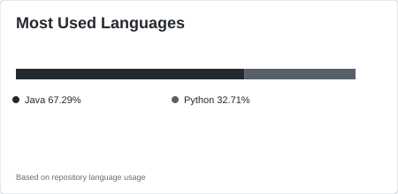

 

<table border="1" cellpadding="12" cellspacing="0" width="100%">
<tr>

<td width="50%" align="center" valign="middle">

</td>

<td width="50%" align="center" valign="middle">

<picture>
  <source media="(prefers-color-scheme: dark)"
          srcset="./profile/stats-dark.svg">
  <source media="(prefers-color-scheme: light)"
          srcset="./profile/stats-light.svg">

  
</picture>

<picture>
  <source media="(prefers-color-scheme: dark)"
          srcset="./profile/top-langs-dark.svg">
  <source media="(prefers-color-scheme: light)"
          srcset="./profile/top-langs-light.svg">

  
</picture>

</td>

</tr>
</table>
